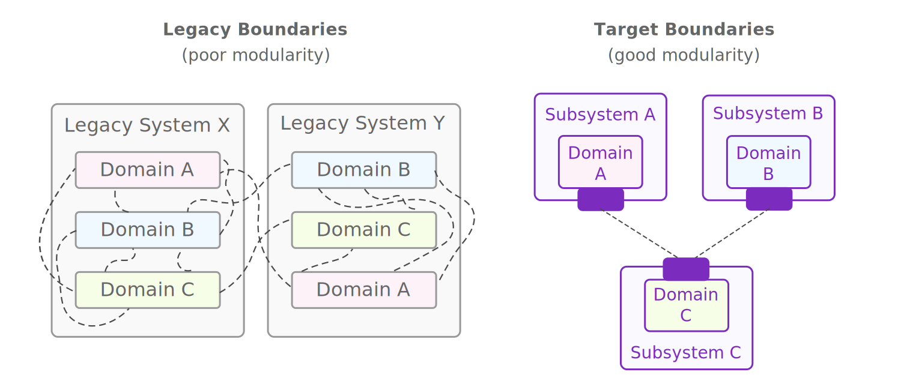

Legacy modernization is not simply a case of rewriting the old system, because the legacy system often has high coupling and poor modularity due to poor encapsulation between components, and logic that should ideally belong together being scattered around the codebase. You don't want carry over all of the unnecessary coupling into your new system, and you need to figure out how to gradually migrate pieces of your legacy that are all highly intertwined.

  



